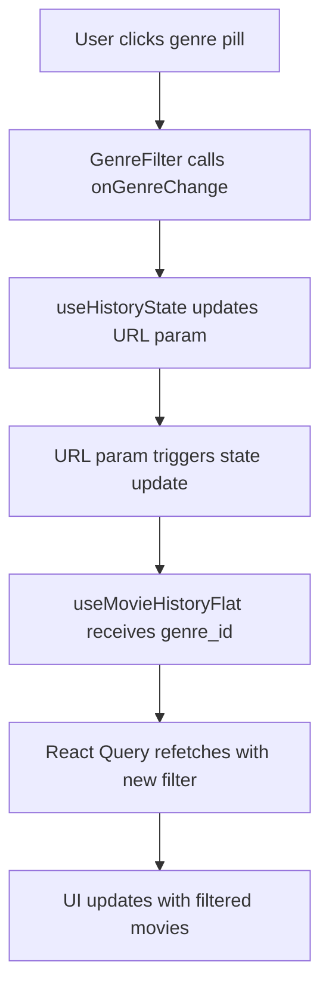

# Genre Filter Implementation Plan

## Overview

Add a horizontal scrollable genre filter with pill buttons to the History page. The selected genre will be stored in URL search params for shareability and persistence across page refreshes.

## API Response Structure

```typescript
{
  "total": 19,
  "results": [
    {
      "id": "c052a0f9-1c95-4015-ad82-1ffc6f52b9ab",
      "name": "Faroeste",
      "tmdbId": 37
    }
  ]
}
```

## Implementation Steps

### 1. Type Definitions (`lib/types/movie.types.ts`)

Add new types for Genre API:

```typescript
export interface Genre {
  id: string
  name: string
  tmdbId: number
}

export interface GenreResponse {
  total: number
  results: Genre[]
}
```

**Files to modify:**

- [`lib/types/movie.types.ts`](lib/types/movie.types.ts)

---

### 2. API Configuration (`lib/config/env.ts`)

Add genres endpoint to apiEndpoints:

```typescript
export const apiEndpoints = {
  // ... existing endpoints
  movies: {
    history: "/me/history/movies",
    genres: "/genres", // NEW
  },
}
```

**Files to modify:**

- [`lib/config/env.ts`](lib/config/env.ts:13-25)

---

### 3. Movie Service (`lib/api/movie-service.ts`)

Add `getGenres` method:

```typescript
export const movieService = {
  // ... existing methods

  /**
   * Get all available genres
   */
  getGenres: async (): Promise<GenreResponse> => {
    const response = await apiClient.get<GenreResponse>(
      apiEndpoints.movies.genres
    )
    return response.data
  },
}
```

**Files to modify:**

- [`lib/api/movie-service.ts`](lib/api/movie-service.ts:13-26)

---

### 4. Genres Hook (`hooks/useGenres.ts`)

Create new React Query hook:

```typescript
import { useQuery } from "@tanstack/react-query"
import { movieService } from "@/lib/api/movie-service"

const GENRES_QUERY_KEY = ["genres"] as const

/**
 * Hook to fetch all available genres
 * Uses React Query for caching and automatic refetching
 */
export function useGenres() {
  return useQuery({
    queryKey: GENRES_QUERY_KEY,
    queryFn: () => movieService.getGenres(),
    staleTime: 30 * 60 * 1000, // 30 minutes (genres rarely change)
    retry: 1,
  })
}
```

**Files to create:**

- `hooks/useGenres.ts`

---

### 5. History State Hook (`hooks/use-history-state.ts`)

Update to manage genre from URL params:

**Key changes:**

- Add `genre` to `HistoryState` interface
- Add `SET_GENRE` and `CLEAR_GENRE` actions
- Use `useSearchParams` from `next/navigation` to read/write URL params
- Initialize state from URL params on mount
- Update URL when genre changes

```typescript
import { useSearchParams, useRouter } from "next/navigation"

export interface HistoryState {
  viewMode: ViewMode
  searchQuery: string
  sortBy: SortByOption
  genre: string | null // NEW
}

type HistoryAction =
  | { type: "SET_VIEW_MODE"; payload: ViewMode }
  | { type: "SET_SEARCH"; payload: string }
  | { type: "SET_SORT"; payload: SortByOption }
  | { type: "SET_GENRE"; payload: string | null } // NEW
  | { type: "CLEAR_SEARCH" }
  | { type: "CLEAR_GENRE" } // NEW

// Add genre handling in reducer
// Initialize from URL params
// Update URL when genre changes
```

**Files to modify:**

- [`hooks/use-history-state.ts`](hooks/use-history-state.ts:1-77)

---

### 6. Genre Filter Component (`components/movie-history/GenreFilter.tsx`)

Create new client component with pill UI:

**Features:**

- Horizontal scrollable container
- "All" pill as default/reset option
- Active pill: solid primary background, white text
- Inactive pill: outlined, muted text, hover effect
- Mobile: horizontal scroll with hidden scrollbar
- Pill specs: 32px height, 13-14px font, 12px padding

```typescript
"use client"

import { useGenres } from "@/hooks/useGenres"
import { cn } from "@/lib/utils"

interface GenreFilterProps {
  selectedGenre: string | null
  onGenreChange: (genreId: string | null) => void
}

export function GenreFilter({ selectedGenre, onGenreChange }: GenreFilterProps) {
  const { data, isLoading, error } = useGenres()

  if (isLoading) return <GenreFilterSkeleton />
  if (error || !data) return null

  const genres = data.results

  return (
    <div className="relative">
      <div className="flex gap-2 overflow-x-auto pb-2 scrollbar-hide">
        {/* "All" pill */}
        <button
          onClick={() => onGenreChange(null)}
          className={cn(
            "h-8 shrink-0 rounded-full px-3 text-sm font-medium transition-colors",
            selectedGenre === null
              ? "bg-primary text-primary-foreground"
              : "border border-border bg-background text-muted-foreground hover:bg-muted hover:text-foreground"
          )}
        >
          Todos
        </button>

        {/* Genre pills */}
        {genres.map((genre) => (
          <button
            key={genre.id}
            onClick={() => onGenreChange(genre.id)}
            className={cn(
              "h-8 shrink-0 rounded-full px-3 text-sm font-medium transition-colors",
              selectedGenre === genre.id
                ? "bg-primary text-primary-foreground"
                : "border border-border bg-background text-muted-foreground hover:bg-muted hover:text-foreground"
            )}
          >
            {genre.name}
          </button>
        ))}
      </div>
    </div>
  )
}

function GenreFilterSkeleton() {
  return (
    <div className="flex gap-2 overflow-x-auto pb-2">
      {[...Array(8)].map((_, i) => (
        <div
          key={i}
          className="h-8 w-20 shrink-0 animate-pulse rounded-full bg-muted"
        />
      ))}
    </div>
  )
}
```

**Files to create:**

- `components/movie-history/GenreFilter.tsx`

---

### 7. History Page Integration (`app/(dashboard)/dashboard/history/page.tsx`)

Integrate GenreFilter component:

**Changes:**

- Import `GenreFilter` component
- Extract `genre` from state
- Add `setGenre` handler
- Pass `genre_id` to `useMovieHistoryFlat`
- Place `GenreFilter` between search controls and content

```typescript
import { GenreFilter } from "@/components/movie-history/GenreFilter"

export default function HistoryPage() {
  const { state, setViewMode, setSearch, setSort, setGenre, clearSearch } =
    useHistoryState()
  const { viewMode, searchQuery, sortBy, genre } = state

  const {
    movies,
    total,
    fetchNextPage,
    hasNextPage,
    isFetchingNextPage,
    isLoading,
    error,
  } = useMovieHistoryFlat({
    sort_by: sortBy,
    query: debouncedSearch || undefined,
    genre_id: genre || undefined, // NEW
  })

  return (
    <HistoryStatusRenderer {...props}>
      <div className="space-y-6">
        {/* Header */}
        <div className="flex flex-col gap-4 sm:flex-row sm:items-center sm:justify-between">
          <PageHeader {...props} />
          <ViewModeToggle {...props} />
        </div>

        {/* Search and Sort Controls */}
        <SearchControlsBar {...props} />

        {/* Genre Filter - NEW */}
        <GenreFilter
          selectedGenre={genre}
          onGenreChange={setGenre}
        />

        {/* Content */}
        {renderView()}

        {/* Infinite Scroll Sentinel */}
        <InfiniteScrollSentinel {...props} />
      </div>
    </HistoryStatusRenderer>
  )
}
```

**Files to modify:**

- [`app/(dashboard)/dashboard/history/page.tsx`](<app/(dashboard)/dashboard/history/page.tsx:1-102>)

---

## Design Specifications

### Pill Button Styles

- **Height:** 32px (`h-8`)
- **Font size:** 13-14px (`text-sm`)
- **Padding:** 12px horizontal (`px-3`)
- **Border radius:** Full rounded (`rounded-full`)
- **Gap between pills:** 8px (`gap-2`)

### Active Pill

- Background: `bg-primary` (green from theme)
- Text: `text-primary-foreground` (white)
- No border

### Inactive Pill

- Background: `bg-background`
- Border: `border border-border`
- Text: `text-muted-foreground`
- Hover: `hover:bg-muted hover:text-foreground`

### Mobile Behavior

- Container: `overflow-x-auto` with `scrollbar-hide`
- Pills: `shrink-0` to prevent compression
- Bottom padding: `pb-2` for scrollbar space

---

## URL Parameter Structure

### Format

```
/dashboard/history?genre=<genre-id>
```

### Examples

- All genres: `/dashboard/history` (no param)
- Action: `/dashboard/history?genre=70d7679a-81ac-48b2-a2e3-0888f24d11b8`
- Drama: `/dashboard/history?genre=17cca494-e1dd-440a-b31a-fd79b74df562`

### Benefits

- ✅ Shareable URLs
- ✅ Browser back/forward navigation
- ✅ Survives page refresh
- ✅ Bookmarkable filtered views

---

## Data Flow



---

## Testing Checklist

- [ ] Genre pills render correctly from API data
- [ ] "All" pill shows as active by default
- [ ] Clicking a genre pill activates it and updates URL
- [ ] URL parameter persists on page refresh
- [ ] Movie list filters correctly when genre is selected
- [ ] Clicking "All" clears the genre filter
- [ ] Pills scroll horizontally on mobile
- [ ] Loading skeleton shows while fetching genres
- [ ] Error handling works if genres API fails
- [ ] Genre filter works with search and sort
- [ ] Browser back/forward navigation works

---

## Files Summary

### New Files (2)

1. `hooks/useGenres.ts` - React Query hook for genres
2. `components/movie-history/GenreFilter.tsx` - Genre pill UI component

### Modified Files (4)

1. `lib/types/movie.types.ts` - Add Genre types
2. `lib/config/env.ts` - Add genres endpoint
3. `lib/api/movie-service.ts` - Add getGenres method
4. `hooks/use-history-state.ts` - Add genre state management with URL params
5. `app/(dashboard)/dashboard/history/page.tsx` - Integrate GenreFilter

---

## Notes

- The `genre_id` parameter already exists in [`MovieHistoryParams`](lib/types/movie.types.ts:64) type
- The API client and React Query setup are already configured
- The project uses Tailwind CSS with custom design tokens
- Primary color is green (`oklch(0.532 0.157 131.589)`)
- The component follows existing patterns from [`SearchBar`](components/movie-history/search-bar.tsx) and [`ViewModeToggle`](components/movie-history/view-mode-toggle.tsx)
